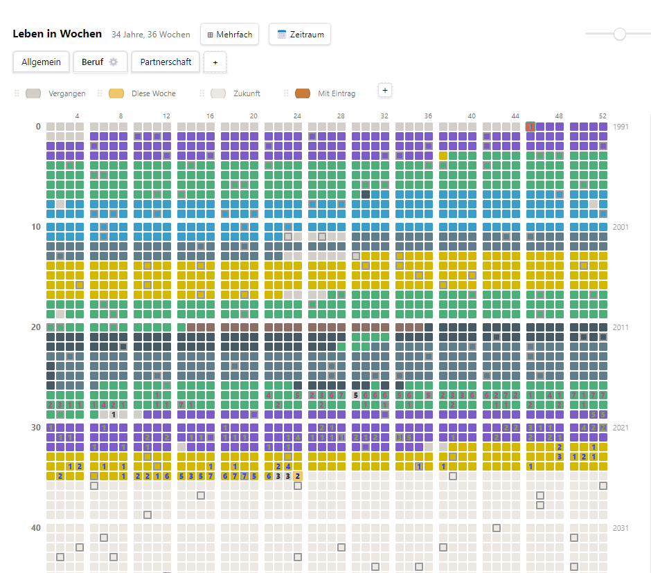

# Life in Weeks – Obsidian Plugin

A "Life in Weeks" grid (for example: 90 years × 52 weeks = 4680 cells) rendered over the weekly and daily notes in your or for creation of new notes (for children, pets, relationships, jobs...) in your vault. 

- Click a cell to open the note, long-press for the day view.

- Set weekly colours. 

- Multi-select to manipulate multiple weeks. 

- Add new tabs for new grids.

- Add a legend for colors.





## Installation

### Option A: Obsidian Community Plugins (once approved)

1. Open **Settings → Community plugins**
2. Disable restricted mode if needed
3. **Browse** → search for "Life in Weeks"
4. **Install** → **Enable**
5. Click the calendar icon in the left sidebar

### Option B: BRAT (beta testers, while review is pending)

1. Install the [BRAT](https://github.com/TfTHacker/obsidian42-brat) plugin from Community Plugins
2. Open BRAT settings → **Add Beta plugin**
3. Paste: `Micha12323/lifeweeks-obsidian`
4. Enable **Life in Weeks** under Community plugins
5. Click the calendar icon in the left sidebar

### Option C: Manual install

1. Download `main.js`, `manifest.json` and `styles.css` from the [latest release](https://github.com/Micha12323/lifeweeks-obsidian/releases/latest)
2. Copy them into `<your-vault>/.obsidian/plugins/lifeweeks/` (create the folder)
3. In Obsidian: **Settings → Community plugins → Reload**, then enable **Life in Weeks**

### First start

A setup screen asks for:
- **Birth date** (`YYYY-MM-DD`)
- **Life expectancy** in years (number of grid rows, default 90)
- **Base folder** in your vault (default `Bibliothek/Diary` – change it to wherever you want `Weekly basis/` and `Daily basis/` to live, e.g. `Journal`)

Tabs are auto-detected from the subfolders of `Weekly basis/` – no separate configuration needed.

## Features

| Feature | How to use |
|---|---|
| Open a weekly note | Short click on a cell **with** a note |
| Set color/title or create a note | Click on an empty cell; **right-click** on a cell with a note |
| Day view (Mon–Sun) + weekly color | **Long-press** (½ second) on a cell |
| Multi-select + bulk edit | **⊞ Multi-select** button + drag-to-select |
| Date range selection | **📅 Date range** button (From/To) |
| Zoom | Slider (middle = fit width, right = zoom in), **Ctrl+wheel**, **pinch** (mobile) |
| View mode | Button next to the slider cycles fit width → fit height → normal size |
| New tab | **+** in the tab bar – creates a folder under `Weekly basis/` |
| Per-tab timeline | ⚙ on the active tab |
| Per-tab legend | Editable (colors, labels, order, custom entries) |
| Language | Follows the Obsidian language (DE/EN UI, all locales for date formats via `Intl`) |
| Open mode | "Open notes in": Automatic / Split right / Main tab bar |

## Click behavior

| Action | Cell **with** note | Cell **without** note |
|---|---|---|
| Short click | opens the note | Quick-Edit popover (color/title/create) |
| Right-click | Quick-Edit for tweaking | Quick-Edit |
| Long-press | Day view + weekly palette | Day view + weekly palette |

### Changing the color afterwards

1. **Right-click** on the cell → palette in the popover (desktop)
2. **Long-press** → palette at the bottom of the day panel (also works on mobile)
3. Directly in the open note: `color` is a regular property in the frontmatter

### Multi-select

1. **⊞ Multi-select** in the header (or open **📅 Date range**)
2. Drag across cells → blue rings
3. Bottom action bar: color + title + content → **Apply to N weeks**
4. Empty input → selected notes go to the **trash**

### Zoom and view modes

- Slider middle (50) = fit width; left → fit all rows; right → zoom in (at least 24 px cell size)
- The **button next to the slider** cycles through three view modes: **↔ fit width** → **↕ fit height** (all rows visible) → **1:1 normal size** (fixed 10 px cells, independent of the window size). The icon always shows the mode the *next* click switches to.
- Moving the slider, Ctrl+wheel or pinching leaves the 1:1 mode again
- Every zoom change **centers on the current week**
- **Ctrl+wheel** over the grid (trackpad pinch on desktop sends Ctrl+wheel too)
- **Two-finger pinch** in the mobile app
- The legend scrolls away together with the grid, so it costs no permanent vertical space

## Data structure

Identical to the browser app – both stay usable in parallel.

```
{base folder}/                 # default: Bibliothek/Diary
├─ Weekly basis/
│  ├─ {Tab1}/                  # tab name = folder name
│  │  ├─ 2026-04-06-W14 Vacation.md
│  │  └─ attachments/
│  └─ {Tab2}/…
└─ Daily basis/                # flat (or Daily basis/{Tab}/ per tab)
   └─ 2026-04-14.md
```

**File names:** `yyyy-mm-dd-Www[ Title].md` (weekly entries), `yyyy-mm-dd[ Title].md` (daily entries).
**Frontmatter** is maintained via `app.fileManager.processFrontMatter()` – foreign keys (e.g. `date`/`time`/`tags` in legacy daily notes) are **never touched**.

### File example

```markdown
---
week: "Jahr 1, Woche 14"
dates: "06.04.2026 – 12.04.2026"
color: "#c97c3a"
title: "Vacation"
---

Markdown content here…
```

> The German YAML labels (`week`, `dates`) are kept for compatibility with the browser app. The UI is fully translated; only the *file format* stays in this form.

## Architecture

```
src/
├─ main.ts                 # Plugin class, View/Ribbon/Command/SettingTab
├─ settings.ts             # basePath, birthDate, lifeExpectancy, openMode, legends, tabConfigs
├─ view.tsx                # ItemView + React root (createRoot)
├─ i18n.ts                 # moment.locale() → DE/EN, Intl date formats
├─ core/                   # pure logic – ported from lifeweeks.html
│  ├─ dates.ts             # rowMonday, weekStartDate, weekKey (UTC fix!), …
│  ├─ filenames.ts         # weekFilename, dailyFilename, buildWeekFileContent, …
│  ├─ milestones.ts        # computeMilestoneWeeks
│  ├─ types.ts
│  └─ dates.test.ts        # vitest – 15 tests
├─ data/                   # vault adapter (replaces FileStore/DirStore of the browser app)
│  ├─ WeekIndex.ts         # builds TabWeeks from MetadataCache
│  └─ DailyIndex.ts        # tolerant reads, foreign frontmatter untouched
└─ ui/                     # React components
   ├─ App.tsx              # state + write actions
   ├─ WeekGrid.tsx         # 4680 cells, memo, single global tooltip
   ├─ WeekQuickEdit.tsx    # popover (portal to document.body)
   ├─ DayPanel.tsx         # long-press: Mon–Sun + weekly palette
   ├─ Legend.tsx           # editable per tab + drag&drop
   ├─ BulkActionBar.tsx
   ├─ TabSettingsModal.tsx # own timeline, ownDailyBasis, milestones
   ├─ DateRangeModal.tsx
   ├─ SetupScreen.tsx
   └─ constants.ts         # palette, legend defaults
```

**Tech stack:** TypeScript + esbuild, React 18 bundled (no CDN). View updates via `metadataCache.changed` + `vault.create/delete/rename` (debounced 400 ms).

### Design decisions

- **No embedded Markdown editor**: weekly notes open natively in Obsidian (split/tab) – this gives CodeMirror 6, image paste, Templater and backlinks for free. CodeMirror 5 (as used in lifeweeks.html) would collide with Obsidian's CM6.
- **`processFrontMatter` instead of YAML rewrite**: protects foreign frontmatter (legacy dailies with `date`/`time`/`tags` are never destroyed).
- **Single global tooltip via event delegation**: only **one** tooltip DOM node instead of 4680.
- **Portals to `document.body`**: Obsidian leaves set `contain: strict`, so `position: fixed` overlays would otherwise stick to the (narrow) panel.
- **The `weekKey` UTC bug from the browser app is fixed in the port** (`localIso` instead of `toISOString`).

## Development

```powershell
cd lifeweeks/obsidian-plugin
npm install
npm run dev      # watch → test-vault/.obsidian/plugins/lifeweeks/
npm test         # vitest
npm run build    # production build (tsc -noEmit + esbuild)
```

`test-vault/` holds copied real-world data (all 3 tabs, an emoji file, legacy dailies, the historical `Beruf/` folder). It is gitignored. The watch mode **never** writes to the real vault.

### Deploy to your real vault (manual workflow)

The script [`deploy.ps1`](./deploy.ps1) copies `main.js`, `manifest.json` and `styles.css` to `MCB/.obsidian/plugins/lifeweeks/` (path baked into the script – adjust for your vault).

```powershell
npm run build
.\deploy.ps1
```

Then in Obsidian: **Settings → Community plugins → Reload**, or use the command palette → "Reload app without saving".

## Compatibility with the browser app

File formats, file names and frontmatter conventions are **identical**. A weekly note created with `lifeweeks.html` shows up in the plugin immediately, and vice versa. Both apps can work on the same data folder in parallel.

## Mobile

The plugin is `isDesktopOnly: false`, and there is **no separate mobile build** – phone and desktop load the very same `main.js` and `styles.css`. Long-press, pinch zoom and Quick-Edit work via Pointer events. The File-System-Access-API gap of the browser app (no iOS support, manual folder picking) goes away entirely.

### Updating on your phone

**Option A: BRAT (recommended).** BRAT runs on mobile and pulls new builds from GitHub releases:

1. Publish a [release](https://github.com/Micha12323/lifeweeks-obsidian/releases) whose tag matches `version` in `manifest.json`, with `main.js`, `manifest.json` and `styles.css` attached as assets
2. On the phone: **Settings → BRAT → Check for updates** (or let BRAT auto-update at startup)
3. **Settings → Community plugins** → toggle **Life in Weeks** off and on again

**Option B: vault sync.** If your sync covers `.obsidian/`, a desktop deploy reaches the phone on its own:

- **Obsidian Sync:** enable **Settings → Sync → Installed community plugins** – without it, plugin folders are skipped
- **Syncthing / iCloud / Dropbox:** works as long as `.obsidian/` is not excluded
- Then toggle the plugin off and on again on the phone

**Option C: manual copy.** Put `main.js`, `manifest.json` and `styles.css` into `<vault>/.obsidian/plugins/lifeweeks/` on the phone (Android: any file manager; iOS: the Files app).

> A fresh build alone is not enough: the plugin code is only re-read after **toggling the plugin off/on** or restarting the app. And always bump `version` in `manifest.json` – otherwise BRAT sees no update.

## License

MIT – see [LICENSE](./LICENSE).
